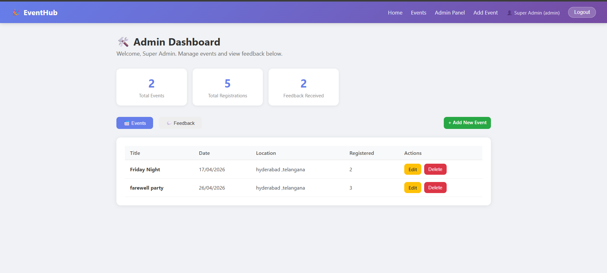
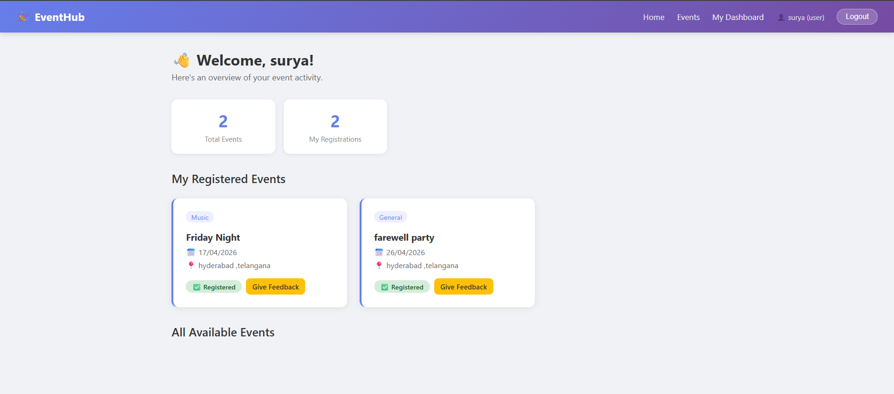
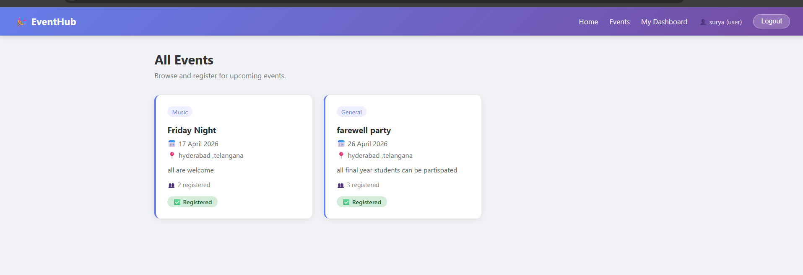
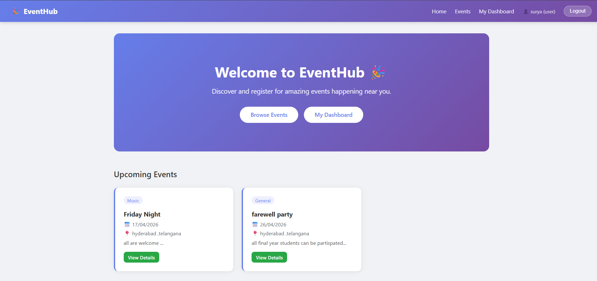
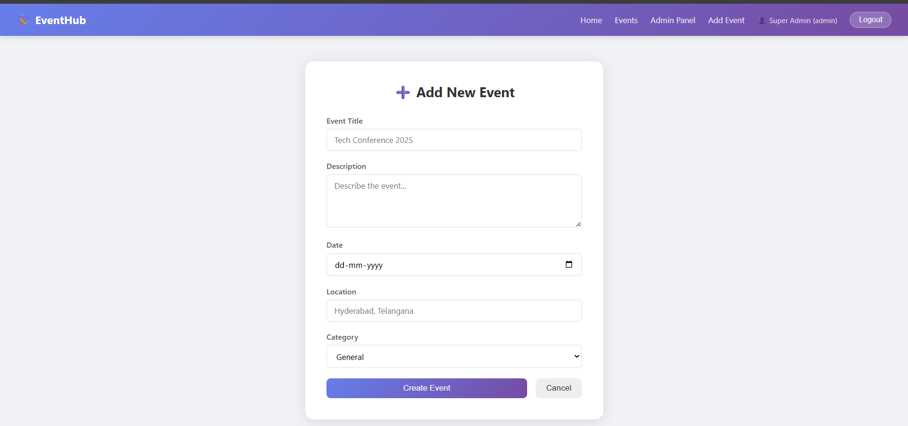

#  EventHub — Full-Stack Event Organizer System

A complete MERN stack (MongoDB, Express, React, Node.js) application for organizing and managing events.
Built for resume, interviews, and portfolio demonstrations.

---

##  Folder Structure

```
event-organizer/
├── server/                    ← Node.js + Express Backend
│   ├── config/
│   │   └── db.js              ← MongoDB connection
│   ├── controllers/
│   │   ├── authController.js  ← Register, Login logic
│   │   ├── eventController.js ← CRUD for events
│   │   └── feedbackController.js ← Feedback logic
│   ├── middleware/
│   │   └── authMiddleware.js  ← JWT protect + adminOnly
│   ├── models/
│   │   ├── User.js            ← User schema (name, email, password, role)
│   │   ├── Event.js           ← Event schema
│   │   └── Feedback.js        ← Feedback schema
│   ├── routes/
│   │   ├── authRoutes.js
│   │   ├── eventRoutes.js
│   │   └── feedbackRoutes.js
│   ├── .env                   ← Environment variables
│   ├── server.js              ← Entry point
│   └── seedAdmin.js           ← Creates first admin user
│
└── client/                    ← React Frontend
    └── src/
        ├── components/
        │   ├── Navbar.js          ← Dynamic navigation bar
        │   └── ProtectedRoute.js  ← Role-based route guard
        ├── pages/
        │   ├── Home.js
        │   ├── Login.js
        │   ├── Register.js
        │   ├── AdminLogin.js
        │   ├── Events.js
        │   ├── UserDashboard.js
        │   ├── AdminDashboard.js
        │   ├── EventForm.js       ← Add + Edit event (same component)
        │   └── Feedback.js
        ├── utils/
        │   ├── api.js             ← Axios instance with auto token
        │   └── AuthContext.js     ← Global auth state (React Context)
        ├── App.js                 ← All routes defined here
        └── index.css              ← Global styles
```

---

##  Prerequisites

Make sure you have these installed:
- [Node.js](https://nodejs.org/) (v16+)
- [MongoDB](https://www.mongodb.com/try/download/community) (local) OR a free [MongoDB Atlas](https://www.mongodb.com/cloud/atlas) cluster
- npm (comes with Node.js)

---

##  Step-by-Step Setup

### Step 1 — Clone / Download the project

```bash
# If using git:
git clone <your-repo-url>
cd event-organizer
```

---

### Step 2 — Set up the Backend (server)

```bash
cd server
npm install
```

Edit the `.env` file:
```
PORT=5000
MONGO_URI=mongodb://localhost:27017/event_organizer
JWT_SECRET=your_super_secret_key_change_this
```

> If using MongoDB Atlas, replace MONGO_URI with your Atlas connection string.

---

### Step 3 — Create the Admin User

```bash
# Still inside the server/ folder:
node seedAdmin.js
```

This creates:
- Email: `admin@eventhub.com`
- Password: `admin123`

---

### Step 4 — Start the Backend Server

```bash
# Development (with auto-restart):
npm run dev

# OR production:
npm start
```

You should see:
```
✅ MongoDB Connected: localhost
🚀 Server running on http://localhost:5000
```

---

### Step 5 — Set up the Frontend (client)

Open a **new terminal**:

```bash
cd client
npm install
npm start
```

The React app opens at: **http://localhost:3000**

---
 
##  Screen shots 











##  Login Credentials

| Role  | Email                   | Password |
|-------|-------------------------|----------|
| Admin | admin@eventhub.com      | admin123 |
| User  | Register via /register  | your choice |

---

##  API Reference

### Auth Routes (`/api/auth`)
| Method | Endpoint              | Access  | Description          |
|--------|-----------------------|---------|----------------------|
| POST   | /api/auth/register    | Public  | Register new user    |
| POST   | /api/auth/login       | Public  | Login, returns token |
| GET    | /api/auth/profile     | Private | Get logged-in user   |

### Event Routes (`/api/events`)
| Method | Endpoint                    | Access       | Description            |
|--------|-----------------------------|--------------|------------------------|
| GET    | /api/events                 | Public       | Get all events         |
| GET    | /api/events/:id             | Public       | Get single event       |
| POST   | /api/events                 | Admin only   | Create event           |
| PUT    | /api/events/:id             | Admin only   | Update event           |
| DELETE | /api/events/:id             | Admin only   | Delete event           |
| POST   | /api/events/:id/register    | Private      | Register for event     |

### Feedback Routes (`/api/feedback`)
| Method | Endpoint                        | Access       | Description              |
|--------|---------------------------------|--------------|--------------------------|
| POST   | /api/feedback                   | Private      | Submit feedback          |
| GET    | /api/feedback                   | Admin only   | Get all feedback         |
| GET    | /api/feedback/event/:eventId    | Public       | Get feedback for event   |

---

##  How Authentication Works

1. User logs in → server returns a **JWT token**
2. Token is stored in **localStorage**
3. Every API request via Axios automatically attaches the token as:
   ```
   Authorization: Bearer <token>
   ```
4. Backend middleware verifies the token on protected routes
5. `adminOnly` middleware checks the `role` field in the token payload

---

##  Features Summary

###  User Features
- Register / Login
- View all events
- Register for events (one click)
- View registered events on personal dashboard
- Submit star-rated feedback

###  Admin Features
- Separate admin login page
- Admin dashboard with stats
- Add / Edit / Delete events
- View all user feedback with ratings
- Protected routes — users can't access admin pages

---

##  Technologies Used

| Layer     | Technology                    |
|-----------|-------------------------------|
| Frontend  | React.js, React Router v6     |
| HTTP      | Axios                         |
| Backend   | Node.js, Express.js           |
| Database  | MongoDB + Mongoose            |
| Auth      | JWT (jsonwebtoken), bcryptjs  |
| Styling   | Custom CSS                    |

---

##  Common Issues & Fixes

**MongoDB not connecting?**
- Make sure MongoDB service is running: `mongod` (Linux/Mac) or start MongoDB from Services (Windows)
- Or switch to MongoDB Atlas and update MONGO_URI

**CORS error?**
- Make sure the backend is running on port 5000
- The `"proxy"` field in client/package.json handles this in development

**Token errors?**
- Clear localStorage in browser DevTools → Application → Local Storage → Clear all
- Re-login

---

##  Build for Production

```bash
# Build React frontend
cd client && npm run build

# Serve the build folder using a static file server or deploy to Vercel/Netlify
```


